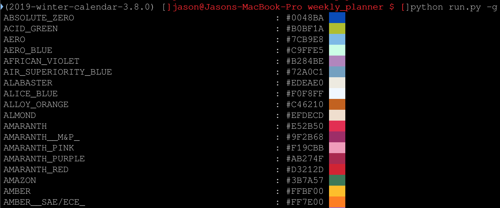
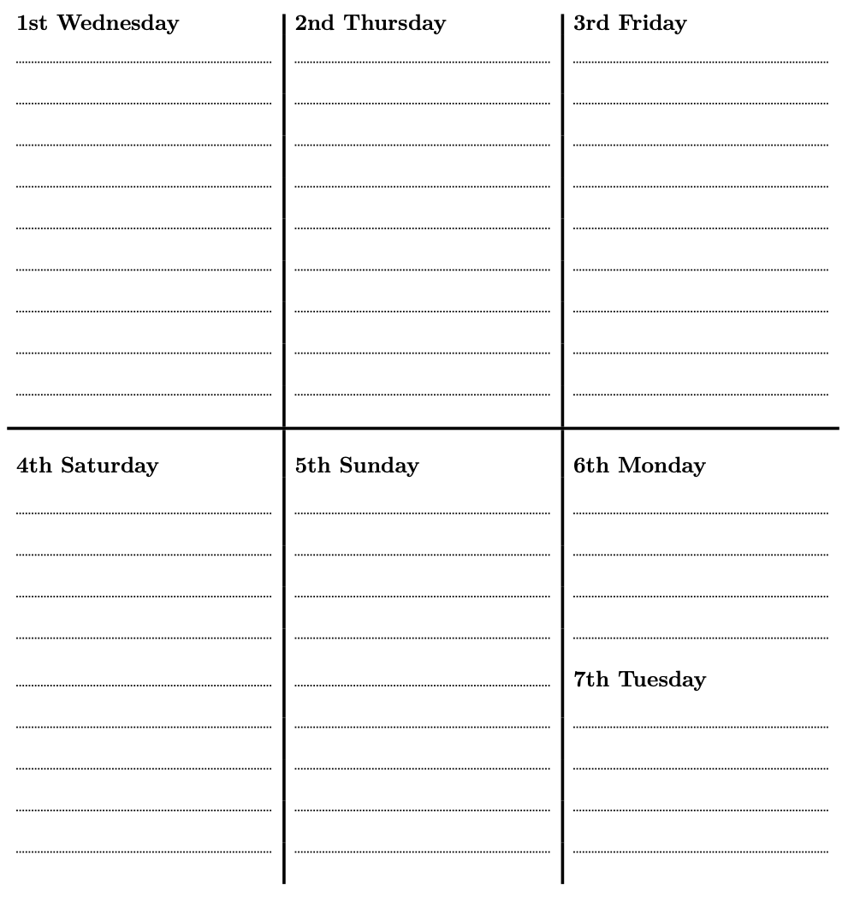
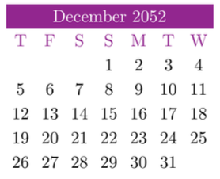

# Weekly Planner
[](https://travis-ci.org/JasonYao/weekly-planner)

By [Jason Yao](https://github.com/JasonYao/weekly-planner)

> Made as a 2019 winter gift for my SO, so she can now obsessively plan everything on her own terms

This repo will automatically generate the custom weekly planner
and then distribute it to be publicly available.

The program makes it easy to dynamically create a planner:
- For a given year
  - `python run.py 2053 && xelatex weekly-planner-2053.tex`
- For multiple years
  - ```
    python run.py 2053 2054 2020 1997 \
    && xelatex weekly-planner-2053.tex \
    && xelatex weekly-planner-2054.tex \
    && xelatex weekly-planner-2020.tex \
    && xelatex weekly-planner-1997.tex
    ```
- With a set of primary/secondary colors
  - ```
    python run.py 2053 \
    --primary-color WILD_WATERMELON \
    --secondary-color WINDSOR_TAN \
    && xelatex weekly-planner-2053.tex
    ```
  - To see all available colors with some sample coloring, run `python run.py --show-color`,
    which will output the following:
  - 
- With a certain start day of the week (e.g. monday, tuesday, etc.) for
  the weekly planner
  - `python run.py 2053 --planner-start-day wednesday && xelatex weekly-planner-2053.tex`
  - 
- With a certain start day of the week (e.g. monday, tuesday, etc.) for
  the mini monthly calendar
  - `python run.py 2053 --calendar-start-day thursday && xelatex weekly-planner-2053.tex`
  - 
- Or all of the above all at once!
  - ```sh
    python run.py 1920 2054 2020 1997 \
    --primary-color WILD_WATERMELON \
    --secondary-color WINDSOR_TAN \
    --planner-start-day tuesday \
    --calendar-start-day friday \
    && xelatex weekly-planner-1920.tex \
    && xelatex weekly-planner-2054.tex \
    && xelatex weekly-planner-2020.tex \
    && xelatex weekly-planner-1997.tex
    ```

Every run, the following years will be generated:
- The current year
- The next year

## Links
To download the links, click on the links below. For a specific year, replace `2020` with the year that you're interested in:
- Weekly version (https://www.jasonyao.com/weekly-planner/weekly-planner-2020.pdf)
- Biweekly version (https://www.jasonyao.com/weekly-planner/biweekly-print-version-2020.pdf)

## Preview
Click on the image previews below to be brought to the pdf version
### Weekly planner (2020)
[](https://www.jasonyao.com/weekly-planner/weekly-planner-2020.pdf)

### Biweekly planner (2020)
- My SO actually prefers using this version, so I made an easy print-friendly version
that changes it from a single week per page to two weeks per page.
[
](https://www.jasonyao.com/weekly-planner/biweekly-print-version-2020.pdf)

## Install (macOS)
```sh
# Installs pdf generation dependencies
brew cask install mactex

# [OPTIONAL] Installs a good pdf viewer and IDE
brew cask install texmaker
```

## Usage
### Create planner for the next 5 years
```sh
bin/build
```

### Create planner for a specific year
```sh
# Generating calendar images and tex files for the year 2020
python run.py 2020

# Generates a weekly planner for 2020
xelatex weekly-planner-2020.tex

# Generates a biweekly planner for 2020
xelatex biweekly-print-version-2020.tex
```

### Help Menu
```sh
python run.py -h
```

## License
This repo is licensed under the terms of the GNU GPLv3 license,
a copy of which may be found [here](LICENSE)
